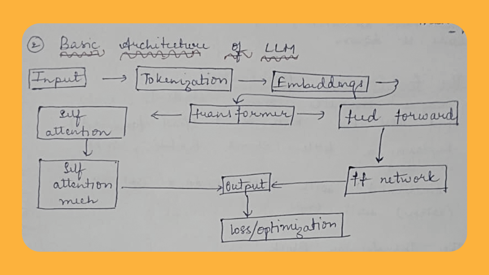

# LLM Implementation from Scratch

A minimal implementation of a GPT-style language model inspired by Andrej Karpathy's [nanoGPT](https://github.com/karpathy/nanoGPT). This project demonstrates the core components of transformer-based language models through clean, readable PyTorch code.

## Project Structure

```
.
├── final.py              # Main LLM implementation
├── input.txt             # Training data (Shakespeare's Coriolanus)
├── Hello.png             # Architecture diagram
├── flask_app/            # Optional web interface for live demonstrations
│   ├── flask_app.py      # Flask server
│   ├── client.py         # CLI client for sending updates
│   └── .env              # Environment configuration
└── README.md             # This file
```

## Model Overview

The implementation in `final.py` builds a complete transformer language model from the ground up, consisting of these key sections:

### 1) Data Loading & Tokenization (Lines 6-24)
- Reads raw text from `input.txt`
- Creates character-level vocabulary (sorting unique characters)
- Implements encoder/decoder functions (`stoi`/`itos`)
- Converts text to tensor and splits into train/validation sets

### 2) Hyperparameters (Lines 26-41)
Configuration parameters controlling model capacity:
- `batch_size`: Number of parallel sequences
- `block_size`: Context length (how far back model can look)
- `max_iters`: Training iterations
- `learning_rate`: Optimization learning rate
- `device`: Uses CUDA if available, else CPU
- `n_embd`: Embedding dimension size
- `n_head`: Number of attention heads
- `n_layer`: Number of transformer blocks
- `dropout`: Regularization probability

### 3) Batching Function (Lines 47-55)
- `get_batch(split)`: Generates random batches of inputs and targets
- Inputs `x`: tokens at positions [t, t+1, ..., t+block_size-1]
- Targets `y`: tokens at positions [t+1, t+2, ..., t+block_size]
- Moves data to appropriate device (CPU/GPU)

### 4) Loss Estimation (Lines 57-71)
- `estimate_loss(model)`: Averages loss over multiple batches for stable metrics
- Switches model to eval mode (disables dropout) during evaluation
- Returns average train and validation loss

### 5) Single Attention Head (Lines 76-113)
- `Head` class: Implements scaled dot-product attention
- Projects input to key/query/value vectors
- Computes attention scores: `softmax(QK^T/√d_k)V`
- Applies causal mask to prevent future token leakage
- Includes dropout for regularization

### 6) Multi-Head Attention (Lines 122-133)
- `MultiHeadAttention` class: Runs multiple attention heads in parallel
- Each head learns different relationships (e.g., syntax, semantics)
- Concatenates head outputs and applies final projection

### 7) Feed-Forward Network (Lines 141-152)
- `FeedForward` class: Token-wise MLP with expansion and contraction
- Expands to 4× embedding size (standard in transformer papers)
- Uses ReLU activation and dropout
- Processes each token independently after attention

### 8) Transformer Block (Lines 159-176)
- `Block` class: Combines communication (attention) and computation (feedforward)
- Uses residual connections around each sub-layer
- Employs pre-LayerNormalization (applied before sub-layers)
- Enables stable training of deep networks

### 9) Full Language Model (Lines 181-226)
- `GPTLanguageModel` class: Complete transformer architecture
- Token embedding table: Learned vectors for each character
- Position embedding table: Learned vectors for each position
- Stack of transformer blocks (`n_layer` deep)
- Final layer norm and language model head
- `forward()`: Computes logits and optional loss
- `generate()`: Autoregressive token generation

### 10) Training Loop (Lines 229-247)
- Standard PyTorch training with AdamW optimizer
- Periodic evaluation and loss printing
- Gradient clipping via `zero_grad(set_to_none=True)`

### 11) Generation (Lines 252-254)
- Initializes context with null token
- Generates 500 new tokens autoregressively
- Decodes and prints the generated text

## Architecture Diagram



*The Hello.png file illustrates the data flow through the transformer architecture, showing how embeddings, attention mechanisms, and feed-forward networks combine to process sequential data.*

## Flask Web Interface

The optional `flask_app/` directory provides a live demonstration interface:

- **flask_app.py**: Simple Flask server serving a real-time code display
- **client.py**: CLI tool for sending text updates to the server
- **.env**: Configuration pointing to a deployed instance

To use locally:
1. Install requirements: `pip install flask python-dotenv requests`
2. Start server: `cd flask_app && python flask_app.py`
3. In another terminal: `python client.py` and type messages ending with "SEND"

## Dependencies

- PyTorch
- Flask (optional, for web interface)
- python-dotenv (optional, for web interface)
- requests (optional, for web interface)

## Training Data

The model is trained on text from Shakespeare's *Coriolanus* (contained in `input.txt`), specifically featuring dialogues between the First Citizen and the All (crowd) characters.

## Inspiration

This implementation directly follows the educational approach of Andrej Karpathy's nanoGPT project, adapting his teachings to a character-level language model with clear, well-commented code that emphasizes understanding over optimization.

To run the model:
```bash
python final.py
```

The model will train for 5000 iterations and then generate sample text based on the learned patterns from the input data.